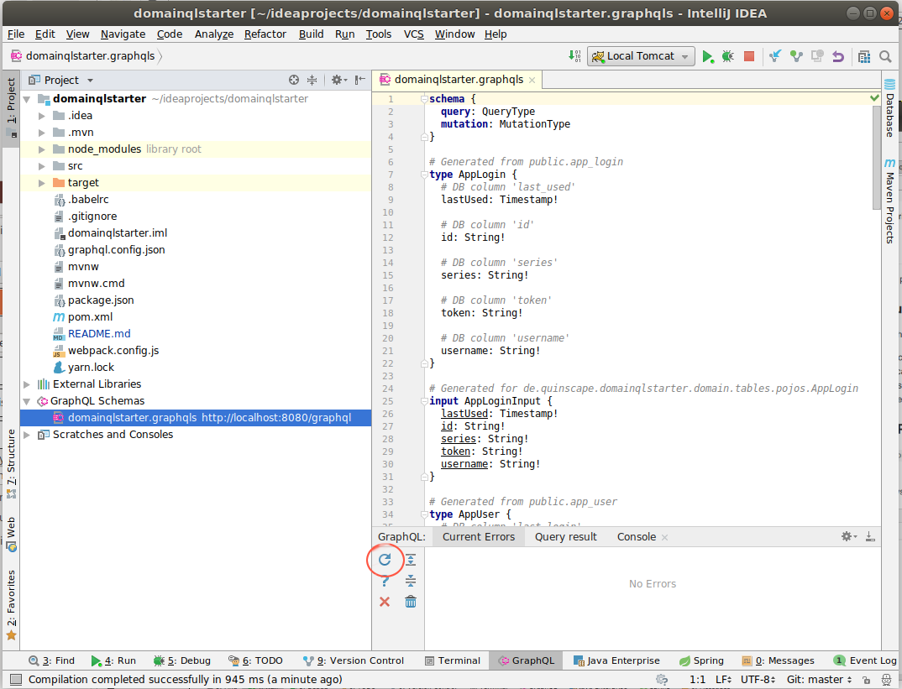

# domainqlstarter 


Skeleton project for domainql based projects.


## Included Technologies

The starter project includes the following libraries / technologies:

### Server

 * maven spring boot 2.0 project
 * GraphQL Endpoint based on graphql-java / domainql
 * Example logic ( DomainqlstarterLogic )
 
### JavaScript Build
 
 * Webpack 4 
 * Babel 
 * mini-css-extract for CSS module imports
 * [shelljs](https://github.com/shelljs/shelljs) as scripting helper. So far minimally used, 
   but also general recommendation for cross-system build-scripting in nodejs projects.
 * Mocha tests with power-asserts (integrated into maven build)
 
### Client

 * React
 * react-router
 * reactstrap
 * redux
 * domainql-form (domainql wrapper for typed formik forms)

## Prequisites

 * [Maven](https://maven.apache.org/download.cgi) 3.5.0 (the spring boot projects come with an alternate mvnw/mvnw.cmd that might also work)
 * [NodeJs](https://nodejs.org/en/download/) v8.11.3+ 
 * [Yarn](https://yarnpkg.com/) v1.7.0+ 
 
## Usage

 * **Clone this repository** and make sure to change the git remote to your new project repository
 * **Customize/Rename** everything to your liking
   * Everything named "domainqlstarter" has to be renamed / changed. 
   * I have marked a lot of places in src/ and pom.xml with "TODO:" 

## Building

The maven build builds both Java and JavaScript in one step and executes tests for both. It
produces a Spring Boot executable WAR. It can be just run from the command line, although the
preferred development workflow is to use a local tomcat server from within the Intellij IDE. 

 
## Running the JavaScript Build 

The JavaScript build can be run on its own. The package.json defines several scripts

```sh
yarn run watch
```

Do a development build and enter watch mode. The build job does not end but instead watches
all build files for changes and automatically recompiles them.

```sh
yarn run build-dev
```

Run a development build (no wait)

```sh
yarn run build
```

Run a production build

```sh
yarn test
```

Run the JavaScript tests.

## IntelliJ

Intellij being the preferred IDE, the project includes project files for IntelliJ.

### Shared Run/Debug Configurations

There are two shared run/debug configurations for intellij defined :

 * "Local Tomcat" - Executes the WAR in a Tomcat 8 instance (nothing special, you might have to install Tomcat 8 if you don't have it already)
 * "All Js Tests" - a run/debug definition for the JavaScript tests set up with the special way to make
 mocha understand modern JavaScript (babel) including the extra transforms for power-asserts.

### GraphQL Plugin

The `graphql.config.json` file defines a GraphQL endpoint ready to use for the [JS GraphQL Plugin for IntelliJ](https://plugins.jetbrains.com/plugin/8097-js-graphql).

With the help of this plugin you can test GraphlQL queries right in the IDE or even within
the source code. The plugin will provide such help for

 * within *.graphql files
 * In source code:
   * If you first inject "GraphQL" as language into a String or  alternatively 
     you can mark GraphQL queries with a comment so that the IDE always knows 
     it's supposed to be graphql.
   
     ```js
     // language=GraphQL
     foo: `{
         foos{
             id
             name
             num
         }
     }`
     ```
   *  If you then edit such a string as fragment, you can execute the query from the 
   fragment window
Note the template literal backtick quotes that allow multi-line strings.

The plugin also allows you to see the current GraphQL schema built by domainql in the Graphql Schema Language.

  

**Note:** Since the local server isn't running when the plugin is started, the first attempt
to request the current schema always fails. After you have started the server, you can click the
refresh button on the first GraphQL tab ( circled in red above). This will reload the schema and 
fix the initial problem. 
